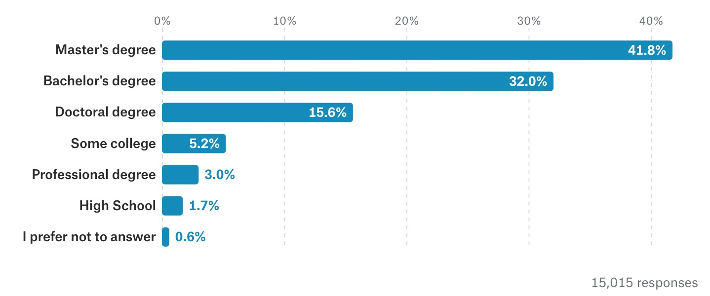

#### 2.1.1.5 Do I need a Ph.D. to work in machine learning?

No, you don’t need a Ph.D. to work in machine learning.

Those who think that a Ph.D. is needed often cite job posts for research scientists that list “Ph.D.” as a requirement. First, research scientist roles make up a very small portion of the ML ecosystem. No other roles, including the popular ML engineer, require a Ph.D.

Even for research scientists, there are plenty of false negatives. For example, OpenAI, one of the world’s top AI research labs, lists only two requirements for their research scientist position:

1. track record of coming up with new ideas in machine learning
2. past experience in creating high-performance implementations of deep learning algorithms (optional)[^22].
The long list of people who have done amazing work in machine learning but don’t have a Ph.D. includes the current OpenAI CTO, IBM Watson master inventor, PyTorch creator, Keras creator, etc.

Companies know that you don’t need a Ph.D. to do ML research, but still require a Ph.D. because it’s a signal that you’re serious about research. At many companies, the people who screen your resumes aren’t technical and therefore rely on weak signals like Ph.D. to decide whether to pass your resume to the hiring managers.

Engineering roles that require PhDs are the exceptions, not the norm. Some candidates complain that they get rejected by big companies because they don't have Ph.D.’s. Unless the rejections explicitly say so, don't confuse correlation with causation. People with PhDs get rejected too.

In November 2017, [Kaggle surveyed 16,000 of their users](https://www.kaggle.com/kaggle/kaggle-survey-2017) and found that 15.6% of those working in data science have a Ph.D., 41.8% have only master’s degrees, and 32% have only bachelor’s. However, among those with the highest income, 37.3% (>$200k/year) and 41.% ($150-200k/year) have a doctoral degree.

If you’re serious about research, a Ph.D. is encouraged. However, you shouldn’t let not having a Ph.D. stop you from applying for a job. If you're interested in a company, build up your portfolio, and apply.

----
[^22]:
     When Google AI opened their office in Tokyo, their requirements for research scientists included a PhD, but the founding research scientist of Google AI Tokyo, David Ha, doesn’t have a PhD.
