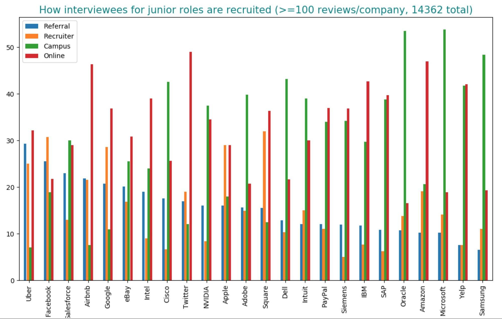

### 2.1.2 How companies source candidates

To get hired, it might be helpful to put yourself where employers are looking. Out of all possible channels for sourcing candidates, referrals are, by far, the best channel. Recruiters have, for a long time, unanimously agreed on the effectiveness of referrals. Here are some numbers:

1. [82% of employers rated employee referrals above all other sources for generating the best return on investment](https://cdn2.hubspot.net/hub/77464/file-17173226-pdf/docs/careerbuilder_referral_madness_ebook.pdf).
1. [Referred candidates are 55% faster to hire compared to candidates sourced through career sites](https://www.hrtechnologist.com/articles/recruitment-amp-onboarding/3-reasons-why-referrals-are-the-way-forward-for-recruitment-in-2018/).
1. [The retention rate of referred employees is 45% after two years, compared to 20% for those from job boards](https://www.ere.net/10-compelling-numbers-that-reveal-the-power-of-employee-referrals/).
1. [Referred candidates are 2.6 to 6.6% more likely to accept an offer](https://www.glassdoor.com/research/studies/interview-sources/).
1. Across all jobs, [referrals account for 7% of applications but 40% of all hires](https://theundercoverrecruiter.com/infographic-employee-referrals-hire). If you’re referred, you’re almost 6x more likely to get your dream job.
	
Sam Altman, CEO of OpenAI and the former president of Y Combinator, wrote that: “[_By at least a 10x margin, the best candidate sources I’ve ever seen are friends and friends of friends_.](https://blog.samaltman.com/how-to-hire)”

Lukas Biewald, founder of two machine learning startups Figure Eight and Weights & Biases, analyzed the performance of 129 hires and concluded that:

“[_Referral quality was incredibly important – the eight worst hires that I’ve been involved in were all unknown to me and everyone at the company at the time of hiring … The average hire was a ‘might hire again’ but the average employee or personal referral was a ‘definitely hire again’_.](https://lukasbiewald.com/2013/10/29/metrics-and-hiring/)”

An analysis of 15,897 Glassdoor interview reviews for software engineering related roles at 27 major tech companies showed that: “[_For junior roles, about 10 - 20% of candidates that get to onsites are referred, with Uber leading the chart with almost 30%. For senior roles, that number is higher. Salesforce, Uber, and Cisco all have approximately 30% of their senior onsite candidates referred_.](https://huyenchip.com/2019/08/21/glassdoor-interview-reviews-tech-hiring-cultures.html)”

The [State of Data Science & Machine Learning survey in 2017 by Kaggle](https://www.kaggle.com/kaggle/kaggle-survey-2017) shows that while most people seeking to enter the field look for jobs through company websites and tech job boards, most people already employed in the field got their jobs through recruiters’ outreach or referrals.

For junior roles, the biggest source for onsite candidates is campus recruiting. Microsoft and Oracle have more than half of their interviewees recruited through campus events such as career fairs and tech talks. Internet giants like Google, Facebook, and Airbnb rely less on campus recruiting, but it still accounts for between 20 and 30% of their onsites. Big tech companies concentrate their recruiting efforts on a handful of popular engineering schools: Stanford, UC Berkeley, MIT, Caltech, CMU, University of Toronto, and the University of Waterloo. The students recruited from those schools then refer their classmates. The circle goes on, turning those major tech companies into a Tech Ivy alumni mixer.

From the employers’ perspective, targeting their most promising sources can reduce the hiring cost as well as the risk of disastrous hires. It is, therefore, not surprising that the default message to most candidates who submit their resumes through less promising sources like online applications is “Thank you, next.” This process is far from ideal as it creates an exclusive, anti-meritocratic environment. Many qualified people are rejected simply because they don’t go to the right school or don’t have the right network. 

If you’re one of these statistically unlucky candidates, one thing you can hope for is that you have a set of skills and/or portfolio that attract recruiters. Around 15 to 25% of onsite candidates for junior roles at each company are contacted by recruiters. For senior roles, this number doubles.

If all else fails, submit your applications and hope for the best. Companies that are the friendliest to online applicants are Twitter, Amazon, and Airbnb with roughly half of their onsite candidates being online applicants. Companies among the most likely to pass on hopeful online applicants are Facebook, Microsoft, and Oracle.

---
*This book was created by [Chip Huyen](https://huyenchip.com) with the help of wonderful friends. For feedback, errata, and suggestions, the author can be reached [here](https://huyenchip.com/communication/). Copyright ©2021 Chip Huyen.*
