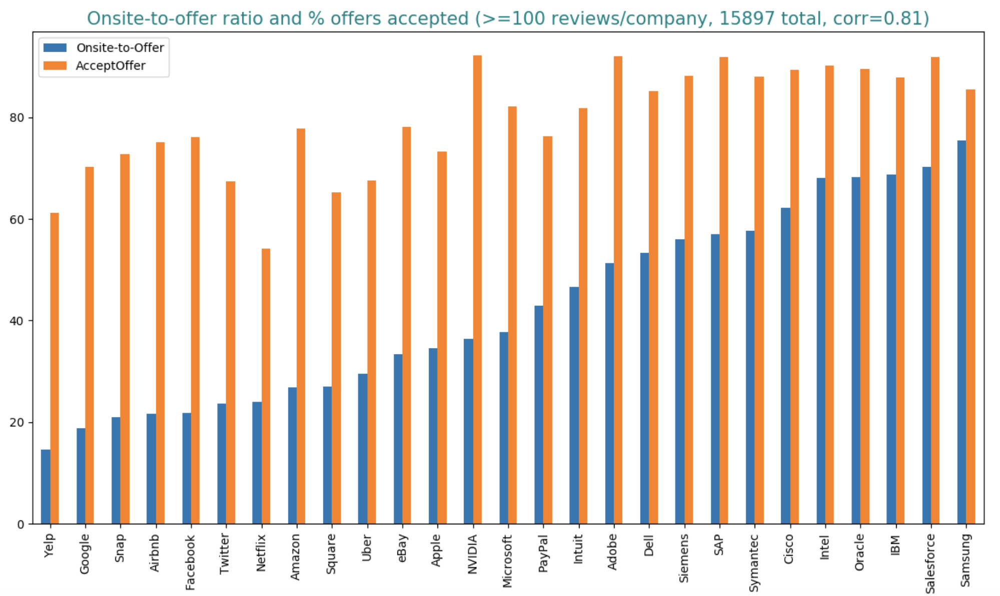

## 2.6 Understanding your odds

When applying for a role, you might wonder what your odds for that role are. If hiring decisions followed a uniformly random distribution, the odds at major tech companies would be abysmal. Each year, [Google receives several million resumes and hires several thousand](https://www.cnbc.com/2019/04/17/heres-how-many-google-job-interviews-it-takes-to-hire-a-googler.html), which makes the odds around 0.2%.

However, the odds are not uniformly distributed for people applying for the same role at the same company. It depends on your profile, whether you’re referred and who referred you, how much the company needs that role, who screens your resume, who they already have in their pipeline, how serious other applicants are.

Companies have very different screening philosophies -- some give every not-obviously-disqualified candidate a phone screen whereas some only respond to the top applicants.

All of these factors, coupled with the fact that few companies publicize the number of resumes they receive or the number of hires each year, make it impossible to estimate the odds from submitting an application to getting an offer.

However, it’s possible to estimate the onsite-to-offer ratio, the percentage of onsites that lead to offers, using the 15,897 interview reviews for software engineering related roles at 27 major tech companies on Glassdoor as of August 2019. This ratio correlates to the yield rate -- the percentage of candidates who accept their offers at a company. Even though the estimation is for software engineering roles, it serves as an indication for ML roles. There are many biases in this data, but hopefully, a large number of reviews smoothes out some noise[^49]. If all reviews suffer from the same biases, they are still useful for comparison across companies.

The data shows that the onsite-to-offer ratio ranges from a low of 15% to a high of 70%, whereas the yield rate goes from 50% to 90%. For example, at Google, 18.83% of onsites lead to offers, and 70% accept their offers.

Due to the biases of online reviews, the actual numbers should be lower. After talking to recruiters and doing extensive research, I found that the onsite-to-offer ratios here are a few percentage points higher than the actual numbers. For example, [this](https://www.teamblind.com/article/Whats-the-onsite-to-offer-ratio-at-your-company-MsLHK2xF) and [this](https://www.teamblind.com/article/Acceptance-rate-after-Google-on-site-YUokaj7w) claim that the onsite-to-offer ratio for Google is 10-20% and Amazon 20%.

The offer yield rate of near 90% is unheard of. Recruiters from companies with high yield rates told me that they aim to get those numbers up to 80%. The two companies leading the chart are NVIDIA, Adobe, SAP, and Salesforce. However, companies like Salesforce encourage candidates who accept their offers to leave reviews on Glassdoor, which inflates their actual yield rates.

The 5 companies with the lowest onsite-to-offer ratios are all Internet giants -- Yelp, Google, Snap, Airbnb, and Facebook -- who are known to be highly selective. Companies with high onsite-to-offer ratios aren’t necessarily unselective. They might be more selective during the screening process and only interview candidates that they really like. Onsites are costly, so the higher the onsite-to-offer ratio, the more financially sound the process.

There’s a strong correlation (0.81) between the onsite-to-offer ratio and the yield rate -- the higher the onsite-to-offer ratio, the higher the yield rate. A candidate that gets an offer from Google is more likely to turn it down than a candidate that gets an offer from a less selective company.

There are several reasons. First, if a candidate passes the interviews at selective companies like Google or Facebook, they probably have other attractive offers to choose from. Second, selective companies tend to make competitive offers, which incentivizes candidates to get offers from them to negotiate with companies that they really want to work for. Third, the process at those companies usually takes a long time. By the time a candidate receives the offer, they might have already settled at another company. Last but not least, since candidates at Google and Facebook only get matched with a team after they’ve received their offers, they might reject the offers if they don’t like the team.

---
[^49]:
     Some of the biases in this data:

    *   Few people actually leave reviews for anything online
    *   Those who do are likely compelled by either a really good or really bad experience
    *   Those who receive offers are more likely to give reviews than those who don’t
    *   Those who accept offers are likely to give reviews than those who don’t
    *   Junior candidates are more likely to give reviews than senior candidates

---
*This book was created by [Chip Huyen](https://huyenchip.com) with the help of wonderful friends. For feedback, errata, and suggestions, the author can be reached [here](https://huyenchip.com/communication/). Copyright ©2021 Chip Huyen.*